# 1. EDA — Análise Exploratória

!!! abstract "Entrega 1 de 3 do [Projeto](../index.md)"

    [Projects](https://insper.github.io/ann-dl/){:target='_blank'}

!!! info "Equipe"

    | Nome completo | GitHub |
    |---------------|--------|
    | Cynthia Naoko Yasutake | CYNahko|
    | Davi Peter Bastian Nehls | dpnnpd |
    | Henrique Bromfman de Puppi e Silva | kikepuppi |

    Dataset, decisões e status: [página do projeto](../index.md).

!!! tip "Como reproduzir"

    Todos os números e figuras desta página saem de dois scripts em `code/`, com
    `random_state=42` em tudo:

    ```bash
    pip install -r requirements.txt
    python docs/projects/eda/code/eda.py            # figuras em figures/ + números no terminal
    python docs/projects/eda/code/preprocessing.py  # só o pipeline: shape, NaN e nomes
    ```

Usamos o *Vehicle dataset from CarDekho*, arquivo `Car details v3.csv`, para prever o preço de
revenda de carros usados (`selling_price`, em rúpias indianas, ₹). É uma tarefa de regressão.

Dos quatro arquivos do pacote do Kaggle, só o `v3` atende a todos os requisitos. O `car data.csv`
tem 301 linhas (o mínimo é 1.000), o `CAR DETAILS FROM CAR DEKHO.csv` não traz especificação técnica
nenhuma e o `car details v4.csv` tem 2.059 linhas, quatro vezes menos que o `v3`.

## 1. Inspeção inicial

### A - Dicionário de dados

Os dados são anúncios de carros usados raspados do site indiano [CarDekho](https://www.cardekho.com){:target='_blank'}
e publicados no Kaggle por Nehal Birla, Nishant Verma e Nikhil Kushwaha (licença DbCL v1.0).
Cada linha é um anúncio de venda de um carro usado, observado uma vez. O anúncio não tem data,
só o ano de fabricação do carro. O arquivo bruto tem 8.128 linhas e 13 colunas.

| # | Coluna | Tipo (decidido por nós) | Unidade / domínio | Observação |
|---|--------|-------------------------|-------------------|------------|
| 1 | `name` | texto (quase identificador) | 2.058 modelos distintos | Dá origem a `brand` (1ª palavra, 32 marcas) e depois é descartada |
| 2 | `year` | numérica discreta | ano de fabricação, 1983 a 2020 | Aproxima a idade do carro |
| 3 | `selling_price` | alvo, numérica contínua | ₹, 29.999 a 10.000.000 | Modelado como `log(preço)` |
| 4 | `km_driven` | numérica contínua | km, 1 a 2.360.457 | Cauda longa extrema |
| 5 | `fuel` | categórica nominal | Diesel, Petrol, CNG, LPG | |
| 6 | `seller_type` | categórica nominal | Individual, Dealer, Trustmark Dealer | |
| 7 | `transmission` | categórica binária | Manual, Automatic | |
| 8 | `owner` | categórica ordinal | First até Fourth & Above, mais Test Drive Car | `Test Drive Car` não encaixa na ordem |
| 9 | `mileage` | texto, convertido em numérica | `"23.4 kmpl"` vira kmpl; km/kg para CNG/LPG | Duas unidades na mesma coluna |
| 10 | `engine` | texto, convertido em numérica | `"1248 CC"` vira cc (cilindradas) | Valores em degraus (796, 998, 1197, 1248…) |
| 11 | `max_power` | texto, convertido em numérica | `"74 bhp"` vira bhp | 7 valores inválidos (`"0"`, `" bhp"`) |
| 12 | `torque` | texto livre, convertido em numérica | `"190Nm@ 2000rpm"`, `"12.7@ 2,700(kgm@ rpm)"` viram Nm | Duas unidades (Nm e kgm); o rpm é descartado |
| 13 | `seats` | numérica discreta | assentos, 2 a 14 | |

Quatro colunas numéricas chegam como texto com unidade (`mileage`, `engine`, `max_power` e `torque`),
então o tipo que o pandas atribui não diz o tipo da variável. O parse fica em `clean()` e `parse_torque()`
([`code/preprocessing.py`](#c-pipeline)). O torque em kgm é convertido para Nm (× 9,80665), com uma
exceção. Seis strings rotuladas como kgm têm valores entre 110 e 190, o que daria, por exemplo, um
Tata Sumo com 1.128 Nm, sendo que o maior torque real do dataset é 640 Nm, de um Volvo. Por isso,
valores acima de 60 marcados como "kgm" são lidos como Nm.

### B - Qualidade

Ausentes no arquivo bruto (8.128 linhas):

| Coluna | Ausentes | % | Padrão |
|--------|---------:|--:|--------|
| `mileage` | 221 (+17 com valor 0) | 2,72 | Em bloco: 215 linhas não têm nenhuma das 5 especificações técnicas |
| `engine` | 221 | 2,72 | idem |
| `max_power` | 215 (+7 inválidos) | 2,65 | idem |
| `torque` | 222 | 2,73 | idem |
| `seats` | 221 | 2,72 | idem |
| demais 8 colunas | 0 | 0 | - |

A ausência não é aleatória. As linhas sem ficha técnica são de carros mais velhos (ano mediano 2008,
contra 2015 nas demais) e mais baratos (preço mediano de ₹175.000, contra ₹450.000), e 92,1% delas
são vendas de particulares. Imputar só a mediana apagaria esse sinal, então o pipeline também cria
uma coluna que indica a ausência (seção 4A).

Encontramos estes valores impossíveis ou inconsistentes:

- `max_power = "0"` ou `" bhp"` (7 linhas) e `mileage = 0` (17 linhas). Viraram `NaN`.
- Em `km_driven`, um carro com 1 km e outro com 2.360.457 km (o segundo maior tem 1,5 milhão).
- Em `torque`, um Maruti de 1.527 cc e 58 bhp com 789 Nm, mais que o Volvo de 400 bhp. É erro de digitação.
- `mileage` mistura kmpl (Diesel/Petrol) e km/kg (88 linhas de CNG/LPG). Os números não são
  comparáveis entre si, mas a unidade acompanha exatamente o combustível, e o one-hot de `fuel`
  absorve a diferença.

Há 1.202 linhas (14,79%) que são cópias exatas de outras, provavelmente o mesmo anúncio raspado
mais de uma vez. Depois do parse e da remoção de `name`, outras 19 ficam idênticas (mesmo carro,
com o modelo escrito de outro jeito). Removemos as 1.221 antes do split, porque a mesma linha cairia
no treino e no teste e o erro de teste passaria a medir memorização. Restam 6.907 linhas.

Duas colunas foram descartadas:

| Coluna | Motivo |
|--------|--------|
| `name` | 2.058 valores em 8.128 linhas, quase um identificador. A parte útil (a marca) fica em `brand` |
| `torque` (texto) | Substituída por `torque_nm`. O rpm de pico vem em formatos irreconciliáveis (`"1750-2500rpm"`, `"+/-500"`) e é descartado |

Nenhuma coluna é posterior à venda; todas descrevem o carro no momento do anúncio. A numérica mais
associada ao preço é `year` (Spearman ρ = 0,706), bem abaixo do patamar que levantaria suspeita de
vazamento (> 0,95). Os riscos de vazamento que encontramos vêm do processo: duplicatas dos dois
lados do split (tratadas acima) e estatísticas de pré-processamento calculadas fora do treino (1D e 4C).

### C - Alvo

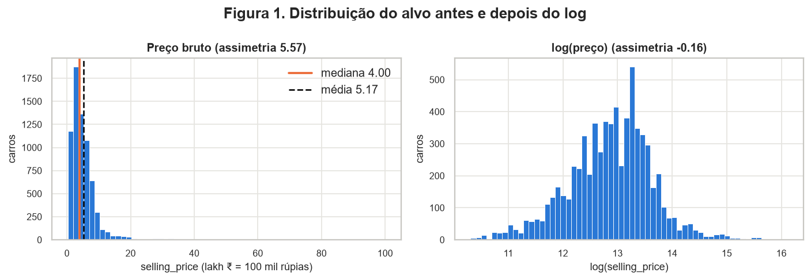

*Figura 1. Distribuição de `selling_price` (6.907 carros após remover duplicatas), em escala bruta e em log.*

| Estatística | Bruto (₹) | log(preço) |
|-------------|----------:|-----------:|
| média | 517.446 | 12,86 |
| mediana | 400.000 | 12,90 |
| desvio padrão | 520.356 | 0,76 |
| mín / máx | 29.999 / 10.000.000 | 10,31 / 16,12 |
| assimetria | 5,57 | −0,16 |
| curtose | 52,7 | 0,70 |

O preço é muito assimétrico à direita. A média fica 29% acima da mediana, e 4,73% dos carros passam
de Q3 + 1,5·IQR. Com MSE no preço bruto, esses ~5% de carros de luxo dominariam o gradiente. Por isso
vamos modelar `y = log(selling_price)`. A assimetria cai de 5,57 para −0,16 e o erro passa a ser
relativo: errar ₹50 mil num carro de ₹2 lakh pesa mais do que num de ₹50 lakh. Para comparação na
próxima entrega, prever sempre a mediana dá um MAE de ₹278.084.

### D - Treino e teste

| | Linhas | log-preço: média | mediana | dp | preço mediano |
|--|------:|------:|------:|------:|------:|
| Treino (80%) | 5.525 | 12,864 | 12,899 | 0,764 | ₹400.000 |
| Teste (20%) | 1.382 | 12,864 | 12,899 | 0,765 | ₹400.000 |

Usamos `train_test_split(test_size=0.2, random_state=42)` estratificado pelos decis de log(preço).
Regressão não tem classes, mas estratificar por faixa de preço garante que os carros de luxo, que são
poucos, apareçam nos dois lados. As médias coincidem até a terceira casa decimal.

O split não é temporal porque o anúncio não tem data (`year` é o ano de fabricação, não o da venda).
Ele acontece depois da remoção de duplicatas e antes de qualquer estatística aprendida. Da seção 2
em diante, todas as figuras e todos os parâmetros (mediana, quantil, média, desvio) vêm só do treino.

## 2. Análise univariada

### A - Numéricas

*Tabela 1. Estatísticas das numéricas no treino (5.525 carros).*

| Coluna | n | média | dp | mín | Q1 | mediana | Q3 | máx | assimetria | % NaN | fora de 1,5·IQR |
|--------|--:|------:|---:|----:|---:|--------:|---:|----:|-----------:|------:|---------------:|
| `year` | 5.525 | 2013,4 | 4,1 | 1983 | 2011 | 2014 | 2017 | 2020 | −1,03 | 0,00 | 65 |
| `mileage` (kmpl) | 5.352 | 19,5 | 4,0 | 9,0 | 16,8 | 19,4 | 22,5 | 42,0 | 0,06 | 3,13 | 5 |
| `seats` | 5.363 | 5,44 | 0,99 | 2 | 5 | 5 | 5 | 14 | 1,92 | 2,93 | 1.176 |
| `km_driven` | 5.525 | 73.333 | 57.195 | 1 | 39.000 | 70.000 | 100.000 | 2.360.457 | 12,63 | 0,00 | 121 |
| `engine` (cc) | 5.363 | 1.430 | 492 | 624 | 1.197 | 1.248 | 1.498 | 3.604 | 1,21 | 2,93 | 965 |
| `max_power` (bhp) | 5.363 | 87,8 | 31,7 | 32,8 | 67,1 | 81,9 | 99,6 | 400 | 1,73 | 2,93 | 236 |
| `torque_nm` (Nm) | 5.363 | 170,9 | 84,0 | 47,1 | 111,7 | 160,0 | 200,1 | 789 | 1,31 | 2,93 | 223 |

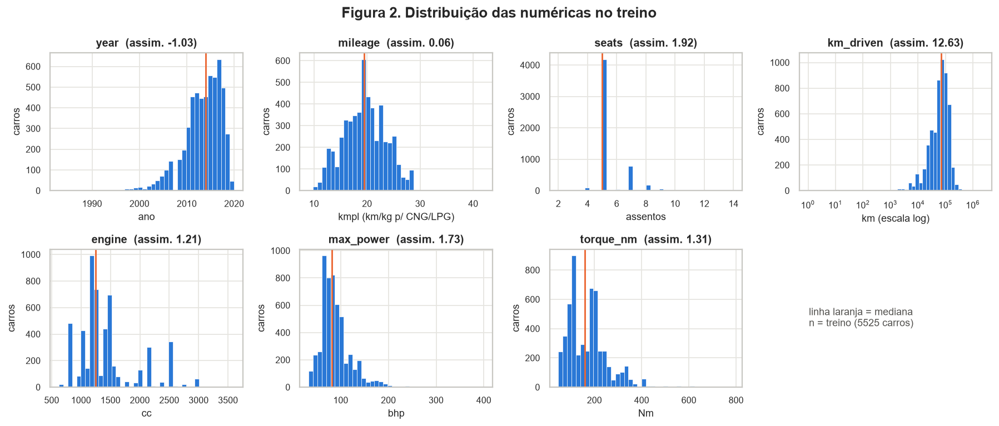

*Figura 2. Histogramas das numéricas no treino (linha laranja = mediana; `km_driven` em escala log).*

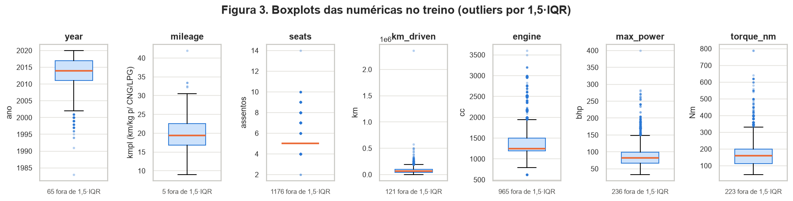

*Figura 3. Boxplots das numéricas no treino, com a contagem de pontos fora de 1,5·IQR.*

`km_driven` é a coluna mais problemática. A assimetria de 12,63 vem quase toda de um carro com
2,36 milhões de km, umas 60 voltas na Terra. Em escala log (Fig. 2) a distribuição é unimodal em
torno de 70 mil km, com uma cauda à esquerda de carros quase zero km. Essa coluna vai ser
winsorizada e depois passar por log.

`engine`, `max_power` e `torque_nm` têm cauda à direita (assimetria entre 1,2 e 1,7) e várias modas
em degraus, porque os motores se concentram em poucas cilindradas de catálogo: 1.248 cc em 739
carros, 1.197 cc em 561 e 796 cc em 330. O log também reduz essa cauda. `year` tem cauda à esquerda
(−1,03), com metade dos carros de 2014 em diante e poucos anteriores a 2000. `mileage` fica quase
simétrica (0,06) depois que os zeros viram `NaN`.

A regra do 1,5·IQR não serve para remover outliers neste dataset. Em `seats`, Q1 = Q3 = 5, o IQR é
zero e todo carro que não tem 5 lugares (1.176) vira "outlier". Em `engine`, os 965 carros marcados
são SUVs e sedãs grandes de verdade (Fig. 3). Em vez de remover linhas, cortamos os valores nos
quantis de 0,5% e 99,5%.

As escalas também são incompatíveis: o desvio de `km_driven` (57.195) é 57.000 vezes o de `seats`
(0,99), o que exige padronização.

### B - Categóricas

*Tabela 2. Frequência e cardinalidade das categóricas (treino).*

| Coluna | Cardinalidade | Categorias (% do treino) | Raras (< 1%) |
|--------|--------------:|--------------------------|--------------|
| `fuel` | 4 | Diesel 54,3 · Petrol 44,2 · CNG 0,85 · LPG 0,60 | CNG (47), LPG (33) |
| `seller_type` | 3 | Individual 89,5 · Dealer 10,0 · Trustmark Dealer 0,45 | Trustmark (25) |
| `transmission` | 2 | Manual 91,6 · Automatic 8,4 | - |
| `owner` | 5 | First 61,5 · Second 28,1 · Third 7,7 · Fourth & Above 2,6 · Test Drive Car 0,07 | Test Drive Car (4) |
| `brand` | 31 | Maruti 31,1 · Hyundai 18,3 · Mahindra 10,5 · Tata 9,6 · … | 14 marcas com < 20 carros (55 no total) |

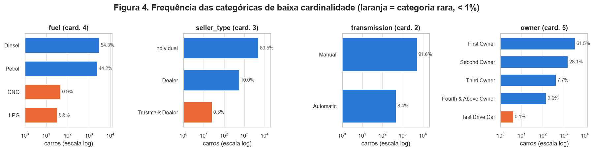

*Figura 4. Frequências das categóricas de baixa cardinalidade (eixo em log; laranja = categoria com menos de 1% do treino).*

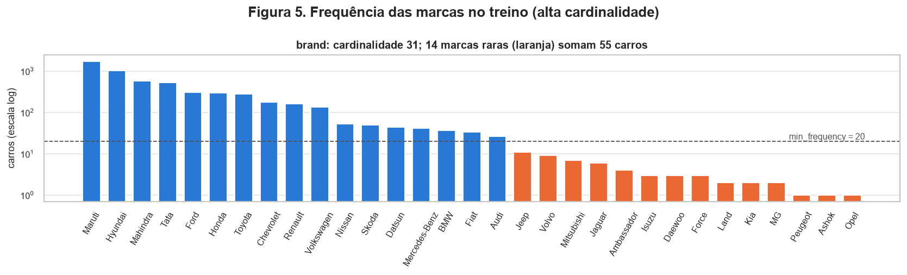

*Figura 5. Frequência das 31 marcas no treino (eixo em log). A linha tracejada é o corte `min_frequency = 20` do codificador.*

O treino é muito desbalanceado: 91,6% dos carros são manuais, 89,5% são vendidos por particulares e
98,6% rodam a diesel ou gasolina. O modelo verá só 463 automáticos e 80 carros a GNV/GLP, e o erro
nesses grupos tende a ser maior. Na entrega 2 ele será medido à parte.

`Test Drive Car` tem 4 carros. São seminovos de concessionária, com preço mediano de ₹60,7 lakh
(Fig. 8), e não cabem na ordem de proprietários como uma "categoria 0". Por isso `owner` é tratada
como nominal (one-hot).

`brand` tem 31 categorias e cauda longa (Fig. 5). As 4 maiores marcas cobrem 69,6% do treino, e 14
marcas somam 55 carros, 6 delas com 1 ou 2. A Lexus aparece só no teste, com 1 carro, e quebraria o
`transform` de um one-hot comum. `OneHotEncoder(min_frequency=20, handle_unknown="infrequent_if_exist")`
junta as marcas raras e as nunca vistas numa mesma coluna. A extração pela primeira palavra trunca
alguns nomes ("Land" é Land Rover, "Ashok" é Ashok Leyland), mas as duas caem em `infrequent` e isso
não afeta o modelo.

## 3. Análise bivariada e multivariada

### A - Numérica x numérica

Usamos Spearman. As numéricas têm caudas longas (`km_driven` com assimetria 12,6), valores em degraus
(`engine`, `seats`) e relações monotônicas não lineares, como a depreciação. Spearman trabalha com os
postos, então um único carro de 2,36 milhões de km não domina o resultado. Pearson aparece ao lado
para mostrar o tamanho da diferença.

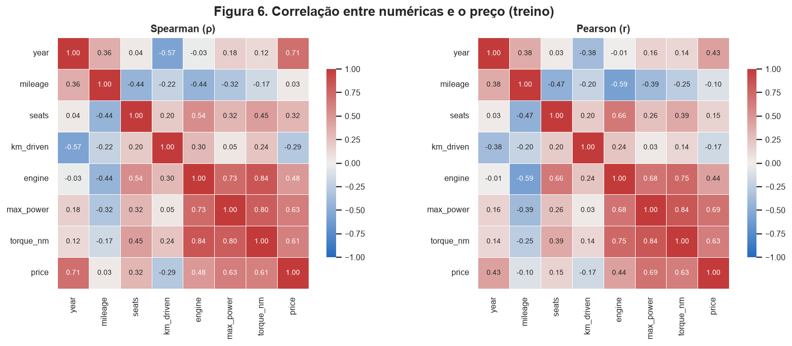

*Figura 6. Matrizes de correlação de Spearman (esq.) e Pearson (dir.) entre as numéricas e o preço, no treino.*

| Par | Spearman ρ | Pearson r | Leitura |
|-----|----------:|---------:|---------|
| `engine` × `torque_nm` | 0,845 | 0,746 | Redundante: as duas medem o tamanho do motor |
| `max_power` × `torque_nm` | 0,799 | 0,840 | Redundante |
| `engine` × `max_power` | 0,727 | 0,682 | Redundante |
| `year` × `km_driven` | −0,567 | −0,382 | Carro mais velho, mais rodado |
| `year` × preço | 0,711 | 0,430 | Monotônica forte, mas curva |
| `max_power` × preço | 0,630 | 0,691 | |
| `mileage` × preço | 0,031 | −0,105 | Sem associação marginal |

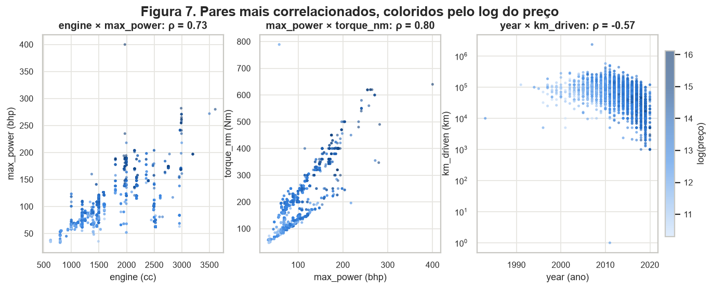

*Figura 7. Os três pares mais redundantes (ou de sinal oposto), coloridos pelo log do preço (treino).*

`engine`, `max_power` e `torque_nm` formam um bloco com correlações entre 0,73 e 0,85. Numa rede
neural isso não impede o treino, já que não há inversão de matriz, mas as três colunas juntas carregam
algo como uma direção e meia de informação. A PCA (seção 4B) mostra as três dominando a PC1.

No par `max_power` × `torque_nm` aparecem duas faixas paralelas (Fig. 7, centro), uma por combustível:
o diesel entrega 2,35 Nm por bhp e a gasolina, 1,36. O mesmo torque descreve carros diferentes
conforme o combustível. Uma MLP consegue aprender essa interação; um modelo linear sem termos de
interação, não.

Entre `year` e preço, ρ = 0,71 e r = 0,43. A distância entre os dois indica uma relação monotônica
curva (depreciação exponencial), que fica quase linear em log(preço), mais um motivo para usar o log
do alvo.

Nenhum par passa de 0,95, então nenhuma coluna sai por redundância. O ponto isolado no alto do
painel central (58 bhp, 789 Nm) é o erro de digitação da seção 1B.

### B - Categórica x alvo

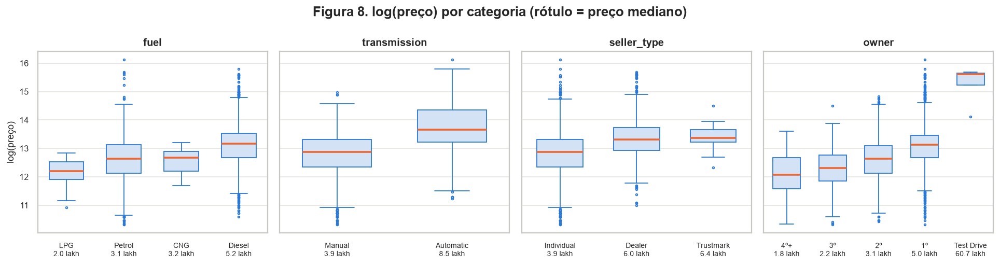

*Figura 8. log(preço) por categoria, ordenado pela mediana; o rótulo traz o preço mediano em lakh (1 lakh = ₹100 mil). Treino.*

| Variável | Menor mediana | Maior mediana | Razão |
|----------|---------------|---------------|------:|
| `transmission` | Manual ₹3,9 lakh | Automatic ₹8,5 lakh | 2,2× |
| `fuel` | LPG ₹2,0 lakh | Diesel ₹5,2 lakh | 2,6× |
| `seller_type` | Individual ₹3,9 lakh | Trustmark Dealer ₹6,35 lakh | 1,6× |
| `owner` (sem Test Drive) | 4º+ dono ₹1,75 lakh | 1º dono ₹5,0 lakh | 2,9× |

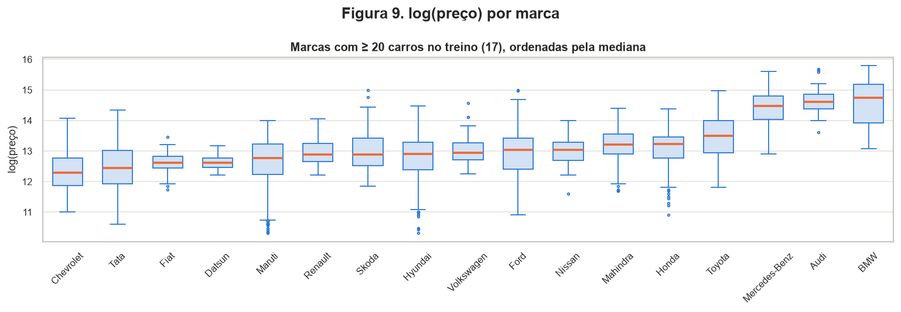

*Figura 9. log(preço) por marca, para as 17 marcas com pelo menos 20 carros no treino.*

As quatro categóricas da Fig. 8 deslocam o preço, e em nenhuma as caixas se sobrepõem por completo.
Em `owner` o preço cai a cada dono (1º > 2º > 3º > 4º+), como se espera da depreciação.

Parte do efeito de `transmission` é potência. Os automáticos têm mediana de 126 bhp, contra 82 dos
manuais (seção 3C), então uma parte da razão de 2,2× vem de o carro ser maior.

`brand` é a categórica com mais efeito (Fig. 9). Entre as marcas com pelo menos 20 carros, a mediana
vai de ₹2,2 lakh (Chevrolet) a ₹25,5 lakh (BMW), 11,7 vezes mais. Mercedes, Audi e BMW ficam num
patamar próprio. É por isso que `brand` entra no modelo mesmo com 31 categorias.

`Test Drive Car` (4 carros, mediana de ₹60,7 lakh) fica fora da escala das outras categorias e não
deve sustentar conclusão nenhuma. No encoder, ela cai em `infrequent`.

### C - Numérica x categórica

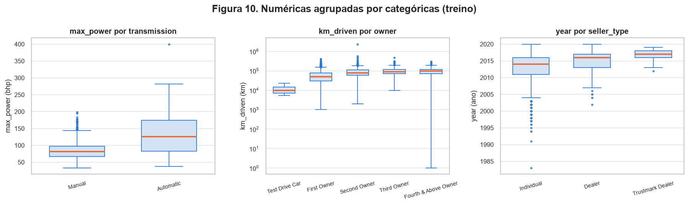

*Figura 10. Boxplots de `max_power` por câmbio, `km_driven` por número de donos (log) e `year` por tipo de vendedor (treino).*

| Par | Grupo | Mediana | IQR | O que muda |
|-----|-------|--------:|----:|-----------|
| `max_power` × `transmission` | Manual / Automatic | 81,8 / 126,2 bhp | 30,8 / 91,2 | Posição e dispersão: automáticos são mais potentes e 3× mais heterogêneos (de hatch a SUV de luxo) |
| `km_driven` × `owner` | 1º / 2º / 3º / 4º+ | 50k / 80k / 90k / 99k km | 50k em todos | Só posição: cada troca de dono soma km e a dispersão fica constante |
| `year` × `seller_type` | Individual / Dealer / Trustmark | 2014 / 2016 / 2017 | 5 / 4 / 2 | Posição e dispersão: revendas certificadas (Trustmark) só aceitam carros novos |

As categóricas e as numéricas andam juntas: `seller_type` carrega idade e `transmission` carrega
potência. Isso explica parte do efeito visto em 3B, e o modelo precisa receber as variáveis em
conjunto para separar uma coisa da outra. O ponto em 1 km no grupo "4º+ dono" é o valor impossível
da seção 1B, que a winsorização eleva para 2.947 km.

## 4. Pré-processamento

### A - Estratégias

Toda estatística abaixo é aprendida com `fit` só no treino e reaplicada ao teste com `transform`.

| # | Problema (onde foi visto) | Estratégia | Parâmetros aprendidos no treino |
|---|---------------------------|------------|-------------------------------|
| 0 | 1.221 duplicatas (1B) | `drop_duplicates()` antes do split | - |
| 1 | Ausentes: 2,9% a 3,1%, em bloco e não aleatórios (1B) | `SimpleImputer(median)` + `MissingIndicator` | medianas: `engine` 1.248 cc, `max_power` 81,9 bhp, `torque_nm` 160 Nm, `mileage` 19,4, `seats` 5. O indicador marca 162 linhas do treino |
| 2 | Outliers: 2,36 milhões de km, 1 km, 789 Nm num carro de 58 bhp (1B, 2A); IQR inadequado (Fig. 3) | `Winsorizer` (quantis 0,5% e 99,5%) | `km_driven` [2.947; 270.000], `max_power` [35; 204], `torque_nm` [59; 500], `engine` [796; 2.982], `year` [1999; 2020], `mileage` [10,9; 28,4], `seats` [4; 9] |
| 3 | Assimetria: `km_driven` 12,6; `max_power` 1,7; `torque_nm` 1,3; `engine` 1,2 (Tabela 1) | `log1p` depois da winsorização | Nenhum. A assimetria cai para −1,05; 0,21; −0,04; 0,52 |
| 4 | Categóricas raras e não vistas: 14 marcas com < 20 carros, Lexus só no teste, `Test Drive Car` com 4 (2B) | `OneHotEncoder(min_frequency=20, handle_unknown="infrequent_if_exist")` | 17 marcas + `infrequent`; `Test Drive Car` vai para `infrequent` |
| 5 | Escalas: dp de 57.195 (km) contra 0,99 (assentos) (2A) | `StandardScaler` | média e dp de cada numérica |
| 6 | Alvo com assimetria 5,57 (1C) | `y = log(selling_price)` no `split()` | - |

Usamos a mediana porque ela resiste às caudas da Tabela 1; a média de `max_power` (87,8) fica 7%
acima da mediana (81,9). O indicador existe porque a ausência traz informação: são carros uns 7 anos
mais velhos e com menos da metade do preço (seção 1B). As 5 especificações faltam juntas, então um
indicador só basta. As 11 linhas a mais no treino, que vêm de `mileage = 0`, são erros pontuais e
só recebem a mediana.

Os outliers são cortados em vez de removidos. Excluir as linhas descartaria SUVs e carros de 7
lugares legítimos (seção 2A), enquanto a winsorização mantém a linha e limita só o valor extremo.
No treino, 201 linhas (3,64%) têm ao menos um valor cortado. No teste, os limites do treino cortam 49 linhas.

Mantivemos o one-hot completo, sem `drop="first"`. Como o notebook da aula mostra, com `drop="first"`
a categoria de referência fica mais perto de todas as outras do que elas entre si, o que distorce a
geometria que t-SNE e UMAP usam. A colinearidade exata do one-hot não atrapalha uma rede neural, que
não inverte matriz.

Redes com ReLU ou tanh treinadas por gradiente precisam de entradas em escalas parecidas. Sem
padronização, os pesos ligados a `km_driven` receberiam gradientes da ordem de 10⁵, e os de `seats`,
da ordem de 1.

### B - Redução de dimensionalidade

As três projeções usam a matriz `Z_tr` (40 colunas) que sai do pipeline ajustado no treino. A cor
é `log(preço)`, que não entra na redução. A PCA usa o treino inteiro (5.525 carros). t-SNE e UMAP usam
uma amostra de 3.000 carros do treino (`seed 42`), porque o t-SNE não tem `.transform()` e seu custo
cresce mais rápido que o número de linhas. Comparamos as projeções com duas métricas:

- trustworthiness (k = 5 e k = 30), que mede se o mapa preserva os vizinhos do espaço original;
- o R² de um kNN (k = 15, CV com 5 folds) que prevê log(preço) a partir das 2 coordenadas, que mede
  se carros vizinhos no mapa têm preço parecido. A silhueta não serve aqui porque o alvo é contínuo.
  Como referência, o mesmo kNN no espaço completo de 40 dimensões chega a R² = 0,875.

#### PCA

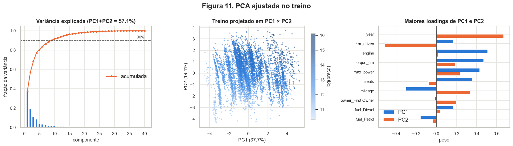

*Figura 11. PCA ajustada no treino: variância explicada (esq.), projeção em PC1 × PC2 colorida por log(preço) (centro) e os 10 maiores loadings (dir.).*

| Componente | 1 | 2 | 3 | 4 | 5 | 9 | 14 |
|------------|--:|--:|--:|--:|--:|--:|--:|
| Variância explicada | 0,377 | 0,194 | 0,113 | 0,084 | 0,037 | 0,018 | - |
| Acumulada | 0,377 | 0,571 | 0,684 | 0,769 | 0,805 | 0,901 | 0,95 |

PC1 e PC2 explicam juntas 57,1% da variância. São necessárias 5 componentes para chegar a 80% e 9
para 90%. Cinco autovalores dão exatamente zero, um para cada bloco de one-hot (`fuel`,
`seller_type`, `transmission`, `owner`, `brand`), porque as colunas de cada bloco somam 1 em toda
linha. O notebook da aula prevê essa dependência linear.

A PC1 descreve o porte do carro: `engine` 0,51, `torque_nm` 0,47, `max_power` 0,43, `seats` 0,36 e
`mileage` −0,30 (carro grande consome mais). São as colunas do bloco redundante da seção 3A. A PC2
descreve idade e uso: `year` 0,67, `km_driven` −0,52 e `mileage` 0,34 (carros novos são mais econômicos).

O preço acompanha mais a PC2 do que a PC1. A correlação de Spearman com log(preço) é 0,724 para a
PC2 e 0,472 para a PC1. No gráfico do centro, a cor escurece na diagonal: carro novo e grande é caro.
A PCA não separa grupos; as faixas verticais que aparecem são os degraus de cilindrada.

#### t-SNE e UMAP

Cada método foi rodado com três valores do parâmetro de vizinhança.

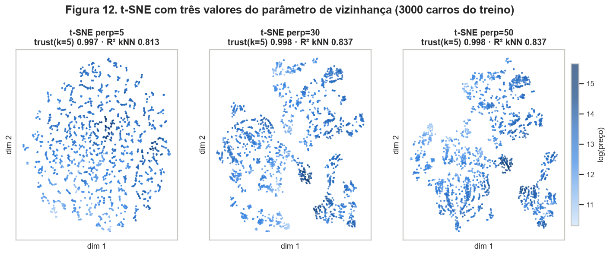

*Figura 12. t-SNE com perplexidade 5, 30 e 50 (`init="pca"`, `random_state=42`), 3.000 carros do treino.*

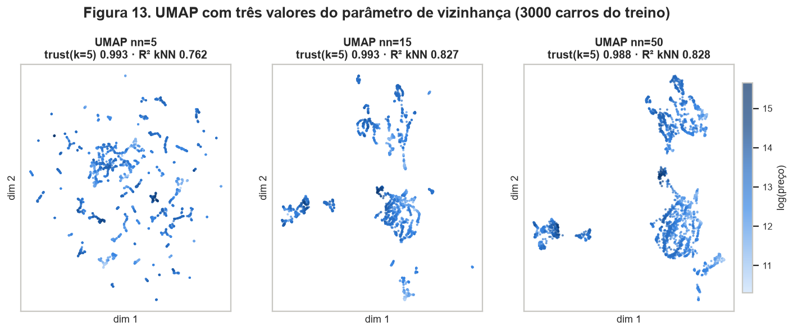

*Figura 13. UMAP com `n_neighbors` 5, 15 e 50 (`min_dist=0.1`, `random_state=42`), mesmos 3.000 carros.*

*Tabela 3. Comparação das projeções (amostra de 3.000 carros do treino).*

| Projeção | trust k = 5 (local) | trust k = 30 (global) | R² kNN do log(preço) | tempo |
|----------|------:|------:|------:|------:|
| PCA (2 comp.) | 0,907 | 0,899 | 0,832 | < 1 s |
| t-SNE perplexidade 5 | 0,997 | 0,960 | 0,813 | ≈ 4 s |
| t-SNE perplexidade 30 | 0,998 | 0,984 | 0,837 | ≈ 5 s |
| t-SNE perplexidade 50 | 0,998 | 0,985 | 0,837 | ≈ 5 s |
| UMAP n_neighbors 5 | 0,993 | 0,927 | 0,762 | ≈ 12 s |
| UMAP n_neighbors 15 | 0,993 | 0,979 | 0,827 | ≈ 6 s |
| UMAP n_neighbors 50 | 0,988 | 0,980 | 0,828 | ≈ 7 s |
| *controle: t-SNE perp. 30 em colunas embaralhadas* | - | - | −0,068 | |

#### O que os métodos não lineares mostram além da PCA

Com perplexidade a partir de 30 e `n_neighbors` a partir de 15, os dois métodos dividem os dados em
5 a 7 ilhas que a PCA não mostra. Para descobrir o que define as ilhas, agrupamos o UMAP
(n_neighbors = 15) em 8 clusters com k-means e medimos a pureza média de cada categórica. `fuel` tem
pureza 0,96 (taxa base 0,54) e `brand`, 0,54 (base 0,32). `transmission` (0,94 contra 0,92) e
`seller_type` (0,90 contra 0,89) ficam no nível da taxa base. As ilhas, portanto, separam combustível
e famílias de marcas, grupos que na PCA se sobrepõem na faixa central.

A vizinhança local também fica bem mais fiel: a trustworthiness em k = 5 sobe de 0,907 na PCA para
0,993 a 0,998. Em k = 30, UMAP e t-SNE ficam em torno de 0,98, também acima da PCA (0,899).

Para o preço, porém, os métodos não lineares quase não ganham da PCA. O R² do kNN é 0,832 na PCA e
0,837 no melhor t-SNE. As duas componentes lineares (idade e porte) já capturam quase tudo o que 2
dimensões conseguem dizer sobre o preço, e dentro de cada ilha a cor varia de forma suave, como na
diagonal da PCA.

Valores pequenos dos parâmetros pioram os mapas. UMAP com `n_neighbors=5` fragmenta o mapa em
dezenas de ilhotas (trust em k = 30 cai para 0,927 e o R², para 0,762), e t-SNE com perplexidade 5
vira uma nuvem uniforme. Os resultados se estabilizam a partir de 30 (t-SNE) e 15 (UMAP), e só
consideramos as ilhas que aparecem nos dois valores maiores.

No controle, o mesmo t-SNE sobre colunas embaralhadas também desenha grupos, mas o R² do preço cai
para −0,07. A estrutura dos mapas reais vem dos dados.

Para o modelo, isso quer dizer que o preço varia de forma suave numa estrutura de baixa dimensão
(idade × porte), com saltos discretos por combustível e marca. Uma MLP sobre as 40 colunas
padronizadas consegue aproveitar esse perfil diretamente. Não vamos usar a redução como entrada:
com 2 componentes a PCA perde 43% da variância, e o t-SNE não projeta dados novos.

### C - Pipeline

O pipeline é um `ColumnTransformer` com quatro ramos, importável de
[`code/preprocessing.py`](https://github.com/ann-dl-projeto/ann-dl-entregas-projeto-cynahko-dpnnpd/blob/main/docs/projects/eda/code/preprocessing.py){:target='_blank'}:

```text
                        ┌─ num  [year, mileage, seats]                     → Winsorizer → mediana → StandardScaler
X_tr (12 cols) ─ split ─┼─ log  [km_driven, engine, max_power, torque_nm]  → Winsorizer → mediana → log1p → StandardScaler
                        ├─ cat  [fuel, seller_type, transmission, owner, brand] → moda → OneHot(min_frequency=20, infrequent_if_exist)
                        └─ miss [engine]                                   → MissingIndicator
```

```python
from preprocessing import load_clean, split, build_pipeline

df = load_clean()                         # parse + brand + drop_duplicates  -> (6907, 13)
X_tr, X_te, y_tr, y_te = split(df)        # 80/20, estratificado por decil, y = log(preço)
prep = build_pipeline().fit(X_tr)         # TODOS os parâmetros vêm do treino
Z_tr, Z_te = prep.transform(X_tr), prep.transform(X_te)
```

Verificações, tiradas da saída de `python docs/projects/eda/code/preprocessing.py` e de `eda.py`:

| Verificação | Resultado | O que prova |
|-------------|-----------|-------------|
| `Z_tr.shape`, `Z_te.shape` | (5525, 40), (1382, 40) | mesma largura nos dois lados |
| NaN no treino / teste | 0 / 0 | a imputação usa no teste as medianas do treino |
| média das 7 numéricas no treino | 0,000 (dp 1,000) | a padronização foi ajustada no treino |
| média das 7 numéricas no teste | entre −0,021 e 0,053 | diferente de zero porque o escalonador não viu o teste |
| Lexus (marca só do teste) | `cat__brand_infrequent_sklearn = 1` | uma categoria nova não quebra o `transform` |

As 40 colunas de saída são 7 numéricas (`num__year`, `num__mileage`, `num__seats`, `log__km_driven`,
`log__engine`, `log__max_power`, `log__torque_nm`), 4 de `fuel`, 3 de `seller_type`, 2 de
`transmission`, 5 de `owner` (4 + `infrequent`), 18 de `brand` (17 marcas + `infrequent`) e
1 indicador (`miss__missingindicator_engine`).

??? example "Código: `code/preprocessing.py`"

    ```python
    --8<-- "docs/projects/eda/code/preprocessing.py"
    ```

??? example "Código: `code/eda.py` (gera todas as figuras e números)"

    ```python
    --8<-- "docs/projects/eda/code/eda.py"
    ```

## 5. Síntese

O preço segue aproximadamente uma log-normal e depende sobretudo de idade e porte. Com o log, a
assimetria cai de 5,57 para −0,16 (Fig. 1). As associações mais fortes são com `year` (ρ = 0,71) e
`max_power` (ρ = 0,63) (Fig. 6), as mesmas direções das duas primeiras componentes da PCA (Fig. 11).

Combustível e marca criam grupos discretos. O carro a diesel custa 2,6 vezes o carro a GLP, e um BMW,
11,7 vezes um Chevrolet (Figs. 8 e 9). As ilhas do t-SNE e do UMAP se definem por combustível
(pureza 0,96) e marca (Figs. 12 e 13), e o diesel muda até a relação entre potência e torque
(2,35 contra 1,36 Nm/bhp, Fig. 7).

Os dados chegaram com muitos problemas: 14,8% de duplicatas, quatro colunas numéricas em texto com
duas unidades, valores impossíveis (0 bhp, 1 km, 789 Nm num carro de 58 bhp) e um bloco de 215
carros sem ficha técnica que não é aleatório (seção 1B). A regra do IQR também engana aqui: ela
marca como outlier 1.176 carros que não têm 5 lugares e 965 motores grandes legítimos (Fig. 3), e por isso
cortamos por quantis em vez de remover linhas.

Riscos para a modelagem e o que faremos na entrega 2:

| Risco | Evidência | Mitigação na entrega 2 |
|-------|-----------|------------------------|
| Erro alto em grupos pequenos (automáticos, CNG/LPG, marcas premium) | 8,4% automáticos; 1,4% CNG/LPG; 14 marcas com < 20 carros (Tab. 2) | Reportar o MAE por subgrupo além do global; o split já é estratificado por preço |
| Métrica dominada por carros caros | assimetria 5,57 (Fig. 1) | Treinar em log(preço); reportar MAE em ₹ e erro percentual (MAPE) |
| Duplicatas inflando o teste | 1.221 linhas (1B) | Já removidas antes do split. Na validação cruzada, o `split` usa sempre o `df` sem duplicatas |
| Vazamento de estatísticas | - | O pipeline inteiro fica dentro do `fit` de cada fold, nunca na base completa |
| Colinearidade entre engine, power e torque | ρ até 0,85 (Fig. 6) | Não prejudica a MLP; usar weight decay e medir a importância por permutação do bloco inteiro |
| Ausência informativa | carros sem ficha técnica são 7 anos mais velhos (1B) | O indicador já está no pipeline |
| Falta de informação sobre o estado do carro (batidas, versão exata) | o kNN em 40 dimensões para em R² = 0,875 | Aceitar um teto de desempenho; comparar a MLP com a baseline da mediana (MAE ₹278.084) e com um modelo linear |

## 6. Qualidade dos dados

| # | Resumo dos resultados | Valor |
|---|---------|-------|
| 1 | Dataset, tarefa e alvo | CarDekho `Car details v3.csv`; regressão; `selling_price` (₹), modelado como `log(selling_price)` |
| 2 | Instâncias x features (numéricas / categóricas) | Bruto: 8.128 × 12 features (+ alvo). Após a limpeza: 6.907 × 12, sendo 7 numéricas e 5 categóricas |
| 3 | Coluna com mais faltantes e seu percentual | Bruto: `torque`, 222 (2,73%). Após a limpeza: `mileage`, 223 (3,23%, incluindo 17 zeros impossíveis) |
| 4 | Colunas descartadas e o motivo | `name` (2.058 valores, quase um ID; dá origem a `brand`); `torque` em texto (substituída por `torque_nm`; rpm descartado). Também saem 1.221 linhas duplicadas |
| 5 | Classe minoritária (%) - ou média e mediana do alvo | Média ₹517.446, mediana ₹400.000 (assimetria 5,57; em log: 12,86 / 12,90) |
| 6 | Tamanho do treino e do teste | 5.525 / 1.382 (80/20, estratificado por decil de preço, seed 42) |
| 7 | Par de numéricas mais correlacionado e o valor | `engine` × `torque_nm`, Spearman ρ = 0,845 |
| 8 | Linhas afetadas pela estratégia de outliers | 201 linhas do treino (3,64%) com pelo menos 1 valor winsorizado; 49 no teste |
| 9 | Variância explicada por PC1 + PC2 | 57,1% (37,7% + 19,4%) |
| 10 | `shape` do treino e do teste após o pipeline | (5525, 40) e (1382, 40), 0 NaN |

## Conclusão

O dataset sustenta uma regressão de preço. São 6.907 carros únicos, o alvo se comporta bem em log,
as duas direções principais (idade e porte) se relacionam com o preço de forma monotônica, e
combustível e marca acrescentam saltos discretos que um modelo não linear pode aproveitar. Um kNN
simples no espaço pré-processado já chega a R² = 0,875 no log do preço, então há bastante estrutura
para uma MLP aprender.

Há três limites. Não dá para generalizar com confiança para carros de luxo e para GNV/GLP, porque há
poucos exemplos; o erro nesses grupos será reportado à parte. Também não dá para fazer validação
temporal: sem a data do anúncio, não há como treinar no passado e testar no futuro, e a inflação entre
anúncios fica como ruído não modelado. Por fim, faltam estado de conservação, histórico de acidentes
e cidade, então parte do preço não é explicável com estas colunas.

Nenhum desses limites inviabiliza a tarefa. Mantemos a regressão de `log(selling_price)` e seguimos
para a entrega 2 com o pipeline desta página.

## Referências

1. Birla, N.; Verma, N.; Kushwaha, N. *Vehicle dataset from CarDekho* (Kaggle). <https://www.kaggle.com/datasets/nehalbirla/vehicle-dataset-from-cardekho>
2. Insper. Redes Neurais e Deep Learning, 2026.2. *Projeto: EDA*. <https://insper.github.io/ann-dl/pt/2026.2/projects/eda/>
3. Insper. *Do EDA à redução de dimensionalidade* (notebook de laboratório, Palmer Penguins). <https://colab.research.google.com/drive/1ytcn6p5Jbk-0swDvGmLOV0qnP5oP0fa5>
4. Pedregosa, F. et al. *Scikit-learn: Machine Learning in Python*. JMLR 12, 2011. Documentação de `ColumnTransformer`, `OneHotEncoder` e `TSNE`: <https://scikit-learn.org>
5. McInnes, L.; Healy, J.; Melville, J. *UMAP: Uniform Manifold Approximation and Projection*. arXiv:1802.03426, 2018.
6. van der Maaten, L.; Hinton, G. *Visualizing Data using t-SNE*. JMLR 9, 2008.
